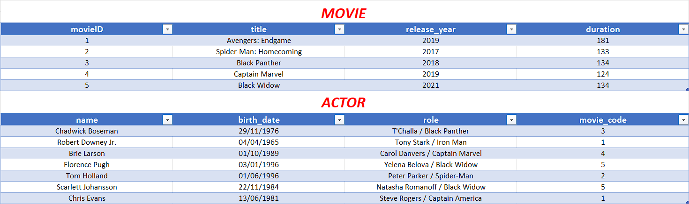

# Challenge 2 : BDD #

## Contexte ##

Ce challenge est issue du discord de l'influenceur tech Frère codeur.
Afin de maintenir une veille technique, progresser et s'amuser, le modérateur SuijoART propose un challenge par semaine et le second concerne les bases de données.

Le but est de réaliser sans contrainte de temps les lignes de codes SQL permettant la création et l'entretien d'une BDD.

## Détail ##

En utilisant le compilateur SQLite présent en ressource (1er lien) ou un autre langage SQL (MySQL, PostgreSQL, Oracle …), réaliser les consignes de chaque niveau.

⚒️  Niveau 1 :

Donner les commandes SQL permettant de créer les tables movie et actor (voir photo)

Quelques indications :

- Le champs movie_code de la table actor est une clé étrangère qui fait référence à la clé primaire movieID de la table movie
- Tous les champs ne doivent pas avoir de contenus vides

Commande(s) à utiliser : CREATE TABLE

⚒️  Niveau 2 :

En reprenant les schémas ci-dessus insérer dans chaque table leurs données respectifs
Commande(s) à utiliser : INSERT INTO

⚒️ Niveau 3 :

1️⃣ Ajouter dans la table movie le film suivant :
    title : Doctor Strange | release_date : 2016 | duration : 115 

2️⃣ Afficher le nom et la date de naissance des acteurs nés après 1990

3️⃣ Afficher le rôle des acteurs ayant joué dans le film intitulé Black Widow

4️⃣ Afficher du plus récent au plus ancien, le titre et la date de sortie de chaque film 

5️⃣ Afficher la durée moyenne de l’ensemble des films

6️⃣ Afficher le nombre total et le titre des films ayant un temps de visionnage inférieur à 120 min

7️⃣ Afficher l’âge actuel de l’acteur nommé “Chris Evans”

8️⃣ Supprimer les films sortis avant 2019
